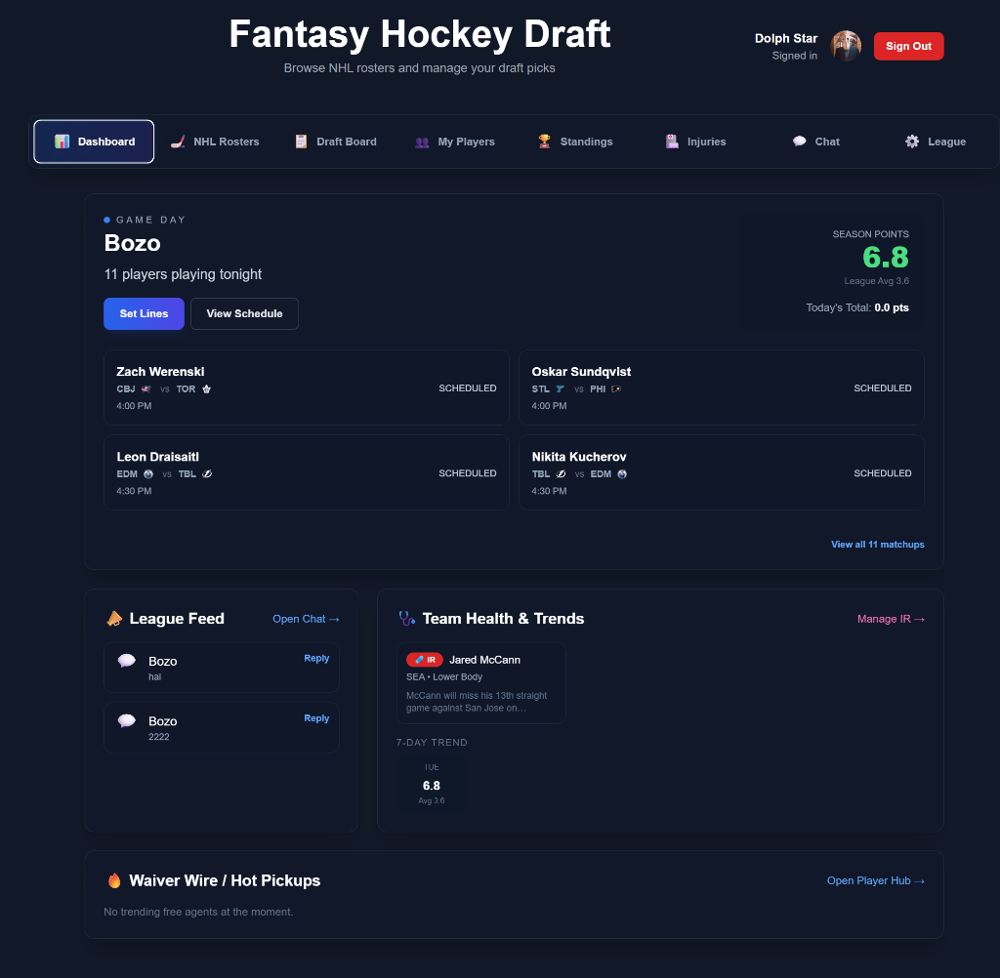
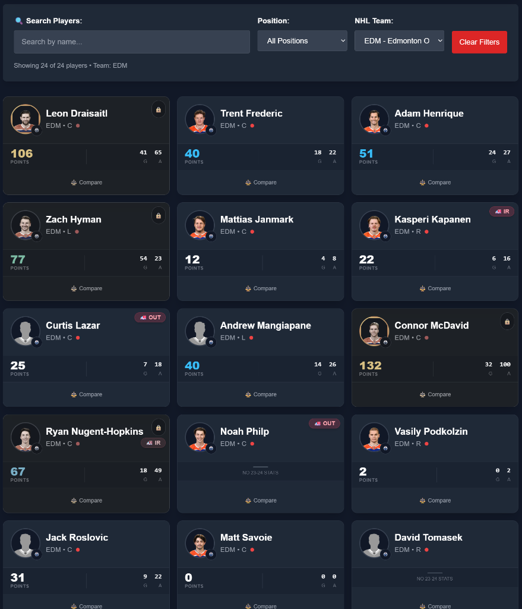
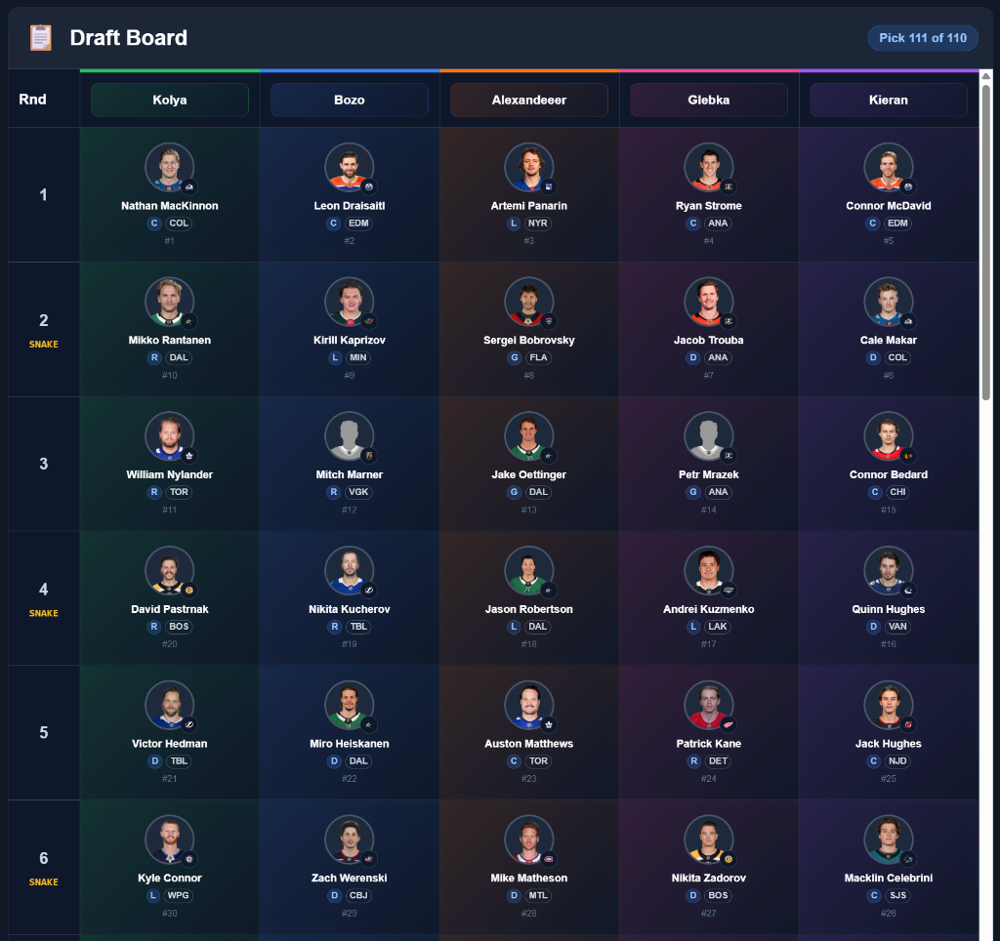
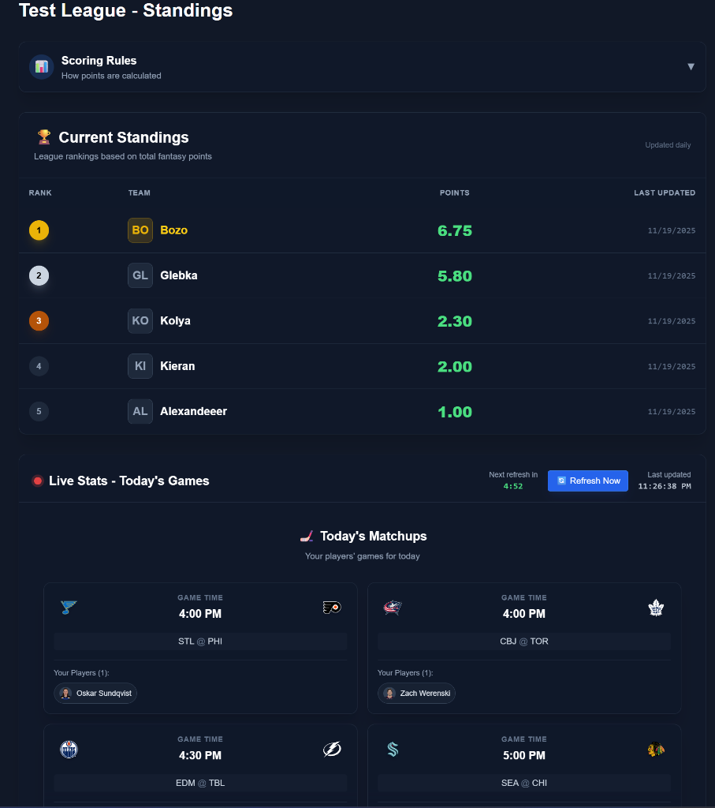
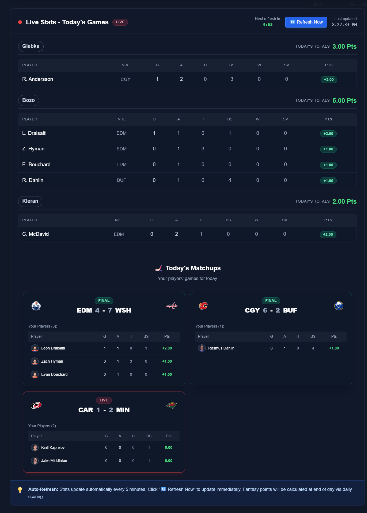

# Fantasy Hockey Draft

A **real-time fantasy hockey draft application** built with React, TypeScript, Firebase, and the NHL API. The app provides a complete fantasy hockey league experience including live drafting, automated daily scoring, real-time game stats, roster management, injury tracking, and league chat.

> ⚠️ **Current Status: Single-League Demo**  
> Currently, the app is hardcoded to run a single active league for demonstration purposes. Multi-tenancy (supporting multiple different leagues simultaneously) is planned for v2.

---

## 🎯 Core Features

### 1. **Snake Draft System**
- **Real-time snake draft** - picks alternate direction each round (Round 1: 1→4, Round 2: 4→1, etc.)
- **Live draft board** - visual grid showing all picks across all teams and rounds
- **Turn-based drafting** - clear indicators for whose turn it is
- **Position enforcement** - enforces roster requirements (9F, 6D, 2G, 5 reserves)
- **Draft status tracking** - real-time updates via Firestore listeners
- **Auto-complete draft** - smart AI feature to automatically fill remaining picks based on roster needs
- **Draft celebration** - confetti animation when you draft a player

### 2. **Automated Scoring Engine**
- **Daily automated scoring** - Vercel cron job runs at 5:00 AM UTC every day
- **NHL API integration** - fetches boxscores from yesterday's games
- **Fantasy point calculation** - based on customizable scoring rules:
  - **Skaters**: Goals (1pt), Assists (1pt), SH Goals (+1 bonus), OT Goals (+1 bonus), Fights (2pts)
  - **Defense**: Blocked Shots (0.15pts), Hits (0.1pts)
  - **Goalies**: Wins (1pt), Shutouts (2pts), Saves (0.04pts), Assists (1pt), Goals (20pts!), Fights (5pts)
- **Team standings** - automatic calculation of total points, wins, losses
- **Player performance tracking** - stores daily stats for each player
- **Idempotent scoring** - prevents duplicate scoring for same date

### 3. **Live Stats Tracking** 
- **Real-time game stats** - updates every 15 minutes during game hours (5 PM - 2 AM ET)
- **Today's games only** - tracks all games happening TODAY
- **Live game indicators** - shows which games are LIVE vs FINAL
- **Auto-updating UI** - stats update automatically via Firestore real-time listeners
- **Team aggregates** - see total stats for each fantasy team today
- **No refresh needed** - updates appear instantly when cron runs

### 4. **Roster Management**
- **Active/Reserve system** - 17 active players (9F/6D/2G) + 5 reserves
- **Player swapping** - swap players between active and reserve rosters
- **Flexible forward swaps** - any forward position (C/L/R) can swap with any other forward
- **Position validation** - defensemen and goalies must swap with same position
- **Pending swap system** - swaps are scheduled for next Saturday at 5 AM
- **Swap cancellation** - cancel pending swaps before they apply
- **Visual indicators** - clear badges showing pending swaps
- **Roster lock schedule** - displays next roster lock date/time

### 5. **Injury Tracking**
- **Real-time NHL injury data** - fetches from sportsdata.io API
- **Injury status badges** - IR (Injured Reserve), DTD (Day-to-Day), O (Out), Q (Questionable)
- **Visual indicators** - color-coded injury icons throughout the app
- **Smart caching** - React Query caches injury data for 5 minutes
- **Auto-refresh** - injury data refreshes automatically in background
- **Injury details** - hover to see injury type and description

### 6. **League Chat**
- **Real-time messaging** - instant chat updates via Firestore
- **User identification** - shows sender name and timestamp
- **Auto-scroll to latest** - automatically scrolls to newest messages
- **Admin moderation** - league admins can delete messages and ban users
- **Ban management** - banned users cannot send messages
- **Emoji support** - full emoji support in messages

### 7. **Dashboard**
- **Draft status overview** - current pick, round, team on the clock
- **Your roster summary** - position counts (F: X/9, D: X/6, G: X/2)
- **Recent picks** - see the last 5 picks made
- **Quick navigation** - shortcuts to main app sections
- **League info** - league name, number of teams, draft progress

### 8. **Player Browsing**
- **Browse by NHL team** - dropdown selector for all 32 NHL teams
- **Position filtering** - filter by F/D/G or "All Positions"
- **Player cards** - beautiful cards with player info, position, jersey number
- **Draft status** - shows if player is already drafted (and by whom)
- **One-click drafting** - "Draft Player" button (only on your turn)
- **Best Available** - see top available players by position
- **Position Scarcity** - shows how many players left at each position
- **Player Comparison** - select multiple players and compare side-by-side

### 9. **League Settings**
- **Create/Update leagues** - admin can create new leagues or update existing ones
- **Team management** - add/remove teams, set team names and owner UIDs
- **Draft rounds configuration** - set number of draft rounds (default: 22)
- **Roster settings** - configure forwards/defense/goalies requirements
- **Start draft button** - admin can start draft when ready
- **Draft reset** - admin can reset draft and clear all picks (danger zone)
- **Test scoring button** - manually trigger scoring for testing (admin only)
- **Test live stats button** - manually update live stats (admin only)
- **Admin player management** - admin tools for managing drafted players

### 10. **Standings Page**
- **Team rankings** - sorted by total fantasy points (descending)
- **Win/Loss records** - displays each team's W-L record
- **Last updated timestamp** - shows when standings were last calculated
- **Scoring rules reference** - collapsible section showing all scoring rules
- **Player performances** - daily stats grouped by team
- **Live stats section** - embedded live game stats for all teams
- **Visual highlights** - first place (gold), last place (red) highlighting

---

## 📸 Screenshots

### Dashboard

*Season overview with live game status, matchups, league feed, team health, and waiver wire pickups*

### NHL Rosters

*Browse and search NHL players by team and position with real-time availability*

### Draft Board

*Visual snake draft grid showing all picks across teams and rounds*

### Standings

*League standings with real-time point totals and rankings*

### Live Stats

*Real-time game stats tracking for all your players during NHL games*

---

## 🛠️ Technical Stack

### Frontend
- **React 19** - Latest React with concurrent features
- **TypeScript** - Type-safe development
- **Vite** - Lightning-fast build tool and dev server
- **TailwindCSS** - Utility-first CSS framework
- **Framer Motion** - Smooth animations and transitions
- **React Query (TanStack Query)** - Smart data fetching and caching
- **Sonner** - Beautiful toast notifications
- **React Confetti** - Celebration effects

### Backend & Database
- **Firebase Firestore** - Real-time NoSQL database
- **Firebase Authentication** - Google sign-in
- **Firestore Security Rules** - Row-level security
- **Vercel Serverless Functions** - API endpoints
- **Vercel Cron Jobs** - Scheduled tasks (scoring, live stats)

### APIs
- **NHL API (api-web.nhle.com)** - Official NHL player rosters and game stats
- **SportsData.io** - NHL injury reports

### Deployment
- **Vercel** - Frontend hosting, serverless functions, cron jobs
- **Firebase Hosting** - Alternative hosting option configured
- **GitHub** - Version control

---

## 🚀 Getting Started

### Prerequisites
- Node.js 18+ and npm
- Firebase account
- Vercel account (for deployment)
- SportsData.io API key (for injury tracking)

### Installation

1. **Clone the repository**
   ```bash
   git clone https://github.com/yourusername/fantasy-hockey-draft.git
   cd fantasy-hockey-draft
   ```

2. **Install dependencies**
   ```bash
   npm install
   ```

3. **Set up environment variables**
   
   Create a `.env.local` file in the root directory:
   ```env
   VITE_FIREBASE_API_KEY=your_firebase_api_key
   VITE_FIREBASE_AUTH_DOMAIN=your_project.firebaseapp.com
   VITE_FIREBASE_PROJECT_ID=your_project_id
   VITE_FIREBASE_STORAGE_BUCKET=your_project.appspot.com
   VITE_FIREBASE_MESSAGING_SENDER_ID=your_sender_id
   VITE_FIREBASE_APP_ID=your_app_id
   VITE_SPORTSDATA_API_KEY=your_sportsdata_api_key
   CRON_SECRET=your_secret_string
   ```

4. **Run development server**
   ```bash
   npm run dev
   ```

5. **Open the app**
   
   Navigate to `http://localhost:5173`

---

## 📚 Documentation

- [SCORING.md](./SCORING.md) - Detailed scoring system documentation
- [DRAFT_SETUP.md](./DRAFT_SETUP.md) - Draft setup guide and roster requirements
- [LIVE_STATS.md](./LIVE_STATS.md) - Live stats feature documentation
- [DEPLOYMENT.md](./DEPLOYMENT.md) - Deployment instructions
- [SECURITY_SETUP.md](./SECURITY_SETUP.md) - Firebase security rules guide

---

## 🎮 Usage

### Creating a League
1. Sign in with Google
2. Go to League Settings
3. Enter league name and configure draft rounds
4. Add teams and assign owner UIDs
5. Click "Create League"
6. Share your league ID with other players

### Starting a Draft
1. Go to League Settings (admin only)
2. Click "Start Draft"
3. League status changes to "Live"
4. Users can now draft in turn order

### Drafting Players
1. Go to "NHL Rosters" tab
2. Select an NHL team from the dropdown
3. Filter by position if desired
4. When it's your turn, click "Draft Player" on any available player
5. Player is added to your roster
6. Draft automatically advances to next pick

### Managing Your Roster
1. Go to "My Players" tab
2. View your active roster (9F/6D/2G) and reserves (5 players)
3. Click "Select to Swap" on a player
4. Click another player in the opposite roster to swap them
5. Swaps are scheduled for next Saturday at 5 AM
6. Cancel pending swaps anytime before they apply

---

## 🔐 Security

### Firestore Security Rules
- **Authentication required** - all operations require sign-in
- **League admin privileges** - only league creator can modify settings, start draft, reset
- **User isolation** - users can only modify their own league's data
- **Roster updates** - league members can swap their own players
- **Chat moderation** - admins can delete messages and ban users

See [SECURITY_SETUP.md](./SECURITY_SETUP.md) for detailed security configuration.

---

## 🧪 Testing

### Admin Developer Tools (League Settings)
- **Test Scoring** - Manually trigger scoring for any date
- **Test Live Stats** - Manually update live stats
- **Draft Reset** - Clear all picks and reset draft state
- **Admin Player Management** - View and manage all drafted players
- **Auto-Complete Draft** - Fill remaining picks with AI logic

---

## 📈 Performance

- **Code splitting** - Lazy loading of components with retry logic
- **React Query caching** - Automatic caching of API responses
- **Virtualized lists** - React Virtuoso for large player lists
- **Firestore listeners** - Efficient real-time subscriptions
- **Indexed queries** - Optimized Firestore queries
- **Image optimization** - NHL team logos from CDN

---

## 🐛 Known Issues & Limitations

- **Injury data** - Depends on sportsdata.io API (requires API key)
- **NHL API rate limits** - No official rate limit, but should respect fair use
- **Firestore costs** - Free tier allows 50k reads/day, 20k writes/day

- **No trades** - Players cannot be traded between teams (future feature)
- **No waiver wire** - Cannot pick up undrafted players mid-season (future)

---

## 🔮 Future Enhancements


- [ ] Trade system between teams
- [ ] Waiver wire / free agent pickups
- [ ] Weekly head-to-head matchups
- [ ] Playoff bracket system
- [ ] Email notifications
- [ ] Mobile app (React Native)
- [ ] Player performance graphs
- [ ] Advanced stats
- [ ] Discord/Slack integration

---

## 🤝 Contributing

This is a personal project, but contributions are welcome! Please follow these guidelines:
1. Fork the repository
2. Create a feature branch (`git checkout -b feature/amazing-feature`)
3. Commit your changes (`git commit -m 'Add amazing feature'`)
4. Push to the branch (`git push origin feature/amazing-feature`)
5. Open a Pull Request

---

## 📝 License

This project is licensed under the MIT License.

---

## 👨‍💻 Author

Built with ❤️ by Nick Birkus

---

## 🙏 Acknowledgments

- **NHL API** - Thank you NHL for providing free access to player and game data
- **SportsData.io** - Injury data API
- **Firebase** - Backend infrastructure
- **Vercel** - Hosting and serverless functions
- **React Community** - Amazing ecosystem and tools