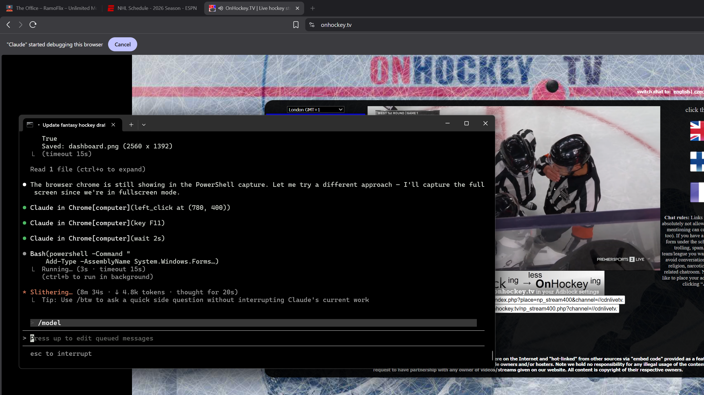
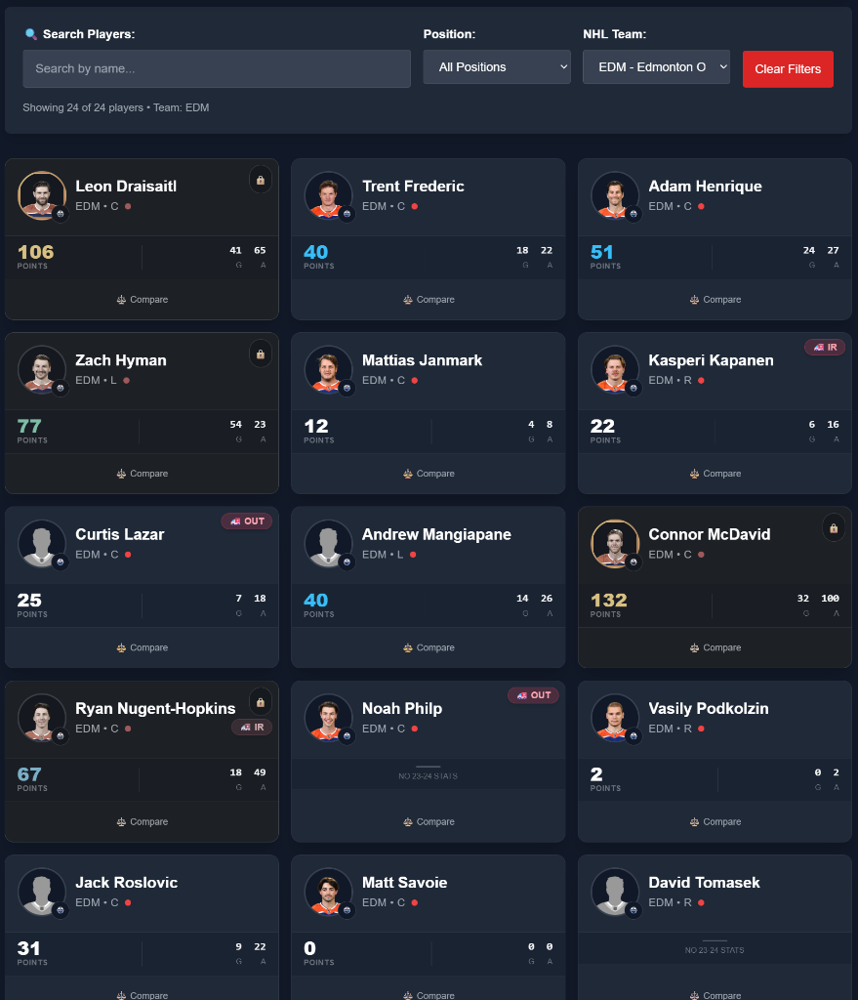
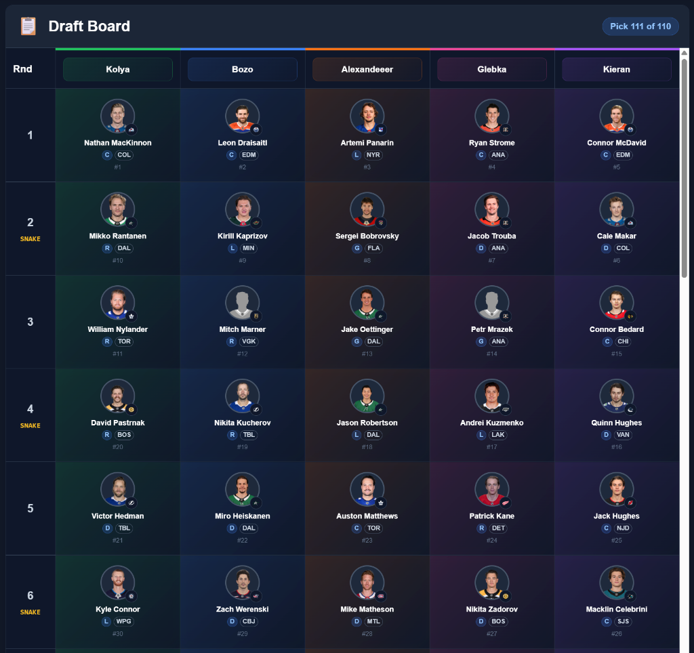
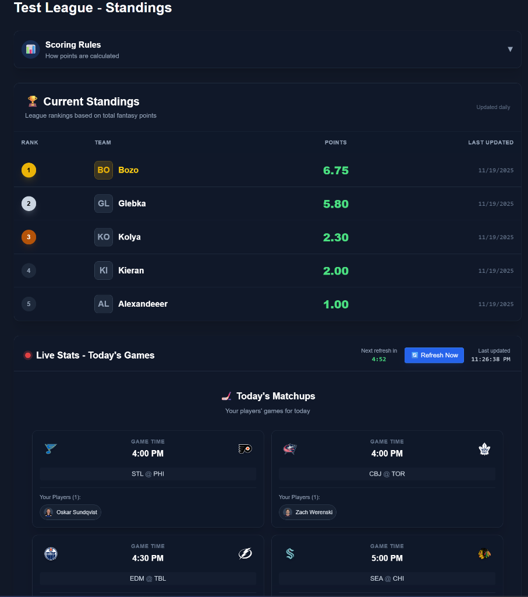
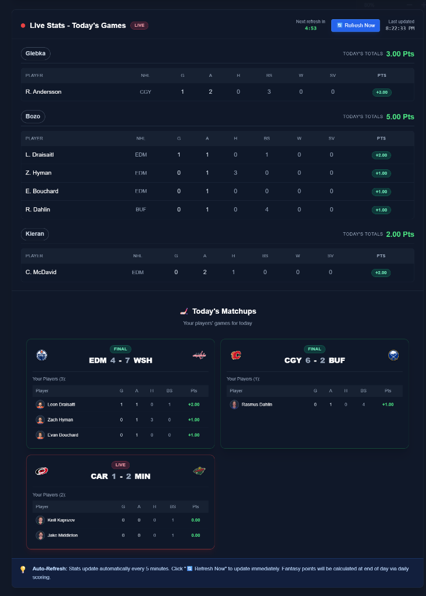

# Fantasy Hockey Draft

A **real-time fantasy hockey draft application** built with React, TypeScript, Firebase, and the NHL API. The app provides a complete fantasy hockey league experience including live drafting, automated daily scoring, real-time game stats, roster management, injury tracking, and league chat.

> ✅ **Current Status: Multi-league, one full season played**  
> The app runs any number of leagues side by side — create one, browse public leagues, or join by invite link. A complete 2025-26 season has been drafted, scored nightly, and archived end to end.
>
> **Scoring is verified against an external reference.** The engine was checked against a completed season on hockeydraft.ca run under identical rules: **143 of 143 player-seasons match exactly**, and the one team that made no in-season roster moves reproduces its published season total to the cent (1053.87). See [HOCKEYDRAFT_PARITY_2025-26.md](./docs/HOCKEYDRAFT_PARITY_2025-26.md).

---

## 🎯 Core Features

### 1. **Snake Draft System**
- **Real-time snake draft** - picks alternate direction each round (Round 1: 1→4, Round 2: 4→1, etc.)
- **Live draft board** - visual grid showing all picks across all teams and rounds
- **Turn-based drafting** - clear indicators for whose turn it is
- **Server-enforced turn order** - Firestore rules, not just the client, gate the draft: an update may only advance the clock by exactly one pick, only the manager who owns the team on the clock may advance it, and `draftOrder`/`totalPicks` are frozen mid-draft. Each pick carries the owner's uid so the rules can check it
- **Position enforcement** - enforces roster requirements (9F, 6D, 2G, 5 reserves)
- **Draft status tracking** - real-time updates via Firestore listeners
- **Auto-complete draft** - smart AI feature to automatically fill remaining picks based on roster needs
- **Draft celebration** - confetti animation when you draft a player

### 2. **Automated Scoring Engine**
- **Scheduled backfill + scoring** - Vercel cron jobs run `/api/fetch-daily-stats` at 4:30 AM UTC and `/api/calculate-scores` at 5:00 AM UTC
- **NHL API integration** - fetches boxscores from the previous New York hockey day
- **Fantasy point calculation** - based on customizable scoring rules:
  - **Skaters**: Goals (1pt), Assists (1pt), SH Goals (+1 bonus), OT Goals (+1 bonus), Fights (2pts)
  - **Defense**: Blocked Shots (0.15pts), Hits (0.1pts)
  - **Goalies**: Wins (1pt), Shutouts (2pts), Saves (0.04pts), Assists (1pt), Goals (20pts!), Fights (5pts)
- **Derived stats the boxscore doesn't carry** - fights come from play-by-play, SH/OT goals and goalie goals/assists from the landing summary, and goalie wins/shutouts from `decision`/`goalsAgainst`. The NHL boxscore has no `wins`, `shutouts` or `shortHandedGoals` fields, so these are computed in `applyDerivedStats`
- **Contract-tested against real API responses** - checked-in trimmed boxscore/landing fixtures guard the field contract (`api/_lib/nhl/realContract.test.ts`)
- **Externally verified** - 143 player-seasons reconciled against another pool provider's engine (see the parity doc)
- **Team standings** - automatic calculation of total points, wins, losses
- **Player performance tracking** - stores daily stats for each player
- **Idempotent scoring** - `processedDates` + increment-based totals prevent double-scoring a date
- **Game-type filtering** - per-league `allowedGameTypes`, so exhibition/Olympic games don't leak into standings

### 3. **Live Stats Tracking** 
- **Real-time game stats** - Firestore-backed live stats update in the UI with manual/admin refresh support
- **Hockey day logic** - games show until 3 AM ET to ensure all games finish before day rolls over
- **Today's Matchups** - see your players' games with team logos and game times
- **Player Performance** - detailed stats table (G, A, H, BS, F, W, Sv, Pts) for all teams
- **Live game indicators** - shows which games are LIVE vs FINAL with color-coded borders
- **Auto-updating UI** - stats update automatically via Firestore real-time listeners
- **Team totals** - see each fantasy team's total points for the day

### 4. **Roster Management**
- **Active/Reserve system** - 17 active players (9F/6D/2G) + 5 reserves
- **Player swapping** - swap players between active and reserve rosters
- **Flexible forward swaps** - any forward position (C/L/R) can swap with any other forward
- **Position validation** - defensemen and goalies must swap with same position
- **Pending swap system** - swaps are scheduled for next Saturday at 5 AM
- **Swap cancellation** - cancel pending swaps before they apply
- **Visual indicators** - clear badges showing pending swaps
- **Roster lock schedule** - displays next roster lock date/time

### 5. **Injury Tracking**
- **Real-time NHL injury data** - fetches from sportsdata.io API
- **Injury status badges** - IR (Injured Reserve), DTD (Day-to-Day), O (Out), Q (Questionable)
- **Visual indicators** - color-coded injury icons throughout the app
- **Smart caching** - React Query caches injury data for 5 minutes
- **Auto-refresh** - injury data refreshes automatically in background
- **Injury details** - hover to see injury type and description

### 6. **League Chat**
- **Real-time messaging** - instant chat updates via Firestore
- **User identification** - shows sender name and timestamp
- **Auto-scroll to latest** - automatically scrolls to newest messages
- **Admin moderation** - league admins can delete messages and ban users
- **Ban management** - banned users cannot send messages
- **Emoji support** - full emoji support in messages

### 7. **Dashboard**
- **Season points display** - your total points vs league average
- **Today's live stats** - real-time points from games in progress
- **Player matchups** - see which of your players are playing today with game times
- **7-day trend chart** - visual graph of your team's performance vs league average
- **League Feed** - real-time activity feed with roster moves, injuries, and chat messages
- **Waiver Wire / Hot Pickups** - top available free agents with player headshots and team logos
- **Team Health card** - injury status for your roster with quick navigation to IR management
- **Quick actions** - "Set Lines" and "View Schedule" buttons

### 8. **Player Browsing**
- **Browse by NHL team** - dropdown selector for all 32 NHL teams
- **Position filtering** - filter by F/D/G or "All Positions"
- **Player cards** - beautiful cards with player info, position, jersey number
- **Draft status** - shows if player is already drafted (and by whom)
- **One-click drafting** - "Draft Player" button (only on your turn)
- **Best Available** - see top available players by position
- **Position Scarcity** - shows how many players left at each position
- **Player Comparison** - select multiple players and compare side-by-side

### 9. **League Settings**
- **Create/Update leagues** - admin can create new leagues or update existing ones
- **Team management** - add/remove teams and rename them; members normally arrive via invite link or join request rather than manual UID entry
- **Invite management** - view and rotate the league's invite code
- **Join requests** - approve or deny requests on public leagues
- **Draft rounds configuration** - set number of draft rounds (default: 22)
- **Roster settings** - configure forwards/defense/goalies requirements
- **Start draft button** - admin can start draft when ready
- **Season controls** - end the season, reopen it, or start a new one
- **Draft reset** - admin can reset draft and clear all picks (danger zone). Also clears that league's scores, so end/archive the season first
- **Test scoring button** - manually trigger scoring for testing (admin only)
- **Test live stats button** - manually update live stats (admin only)
- **Admin player management** - admin tools for managing drafted players

### 10. **Standings Page**
- **Team rankings** - sorted by total fantasy points (descending)
- **Win/Loss records** - displays each team's W-L record
- **Last updated timestamp** - shows when standings were last calculated
- **Scoring rules reference** - collapsible section showing all scoring rules
- **Player performances** - daily stats grouped by team
- **Live stats section** - embedded live game stats for all teams
- **Visual highlights** - first place (gold), last place (red) highlighting

### 11. **Multiple Leagues & Membership**
- **Run any number of leagues** - every route is league-scoped (`/l/:leagueId/...`); no hardcoded league
- **League hub & browse** - see the leagues you belong to, or browse public ones
- **Invite links** - join by code via `/join`; codes live in an Admin-SDK-only collection so they can't be enumerated, and are generated with `crypto` randomness
- **Join requests** - public leagues collect requests for the admin to approve or deny
- **Server-side membership** - join/leave/rotate-invite run through serverless endpoints with verified ID tokens and transactional writes, not client-side guesswork

### 12. **Season Lifecycle**
- **End season** - archives final standings, rosters and stats into an immutable `seasons/{seasonId}` document
- **Auto-end** - the nightly cron closes out a season that has gone idle past the schedule
- **Start new season** - resets for the next year while the archive keeps the old one intact
- **Champion celebration** - takeover banner and confetti for the winning team
- **Season awards** - Best Pick and Best Steal reward value over draft slot (rank-delta), plus Wooden Spoon, top scorers, best single day, and a "your season" recap
- **Season history** - past seasons remain browsable after the reset

---

## 📸 Screenshots

### Dashboard

*Season overview with live game status, matchups, league feed, team health, and waiver wire pickups*

### NHL Rosters

*Browse and search NHL players by team and position with real-time availability*

### Draft Board

*Visual snake draft grid showing all picks across teams and rounds*

### Standings

*League standings with real-time point totals and rankings*

### Live Stats

*Real-time game stats tracking for all your players during NHL games*

---

## 🛠️ Technical Stack

### Frontend
- **React 19** - Latest React with concurrent features
- **TypeScript** - Type-safe development
- **Vite** - Lightning-fast build tool and dev server
- **TailwindCSS** - Utility-first CSS framework
- **Framer Motion** - Smooth animations and transitions
- **React Query (TanStack Query)** - Smart data fetching and caching
- **Sonner** - Beautiful toast notifications
- **React Confetti** - Celebration effects

### Backend & Database
- **Firebase Firestore** - Real-time NoSQL database
- **Firebase Authentication** - Google sign-in
- **Firestore Security Rules** - Row-level security
- **Vercel Serverless Functions** - API endpoints
- **Vercel Cron Jobs** - Scheduled stats backfill and score calculation

### APIs
- **NHL API (api-web.nhle.com)** - Official NHL player rosters and game stats
- **SportsData.io** - NHL injury reports

### Deployment
- **Vercel** - Frontend hosting, serverless functions, cron jobs
- **Firebase Hosting** - Alternative hosting option configured
- **GitHub** - Version control

---

## 🚀 Getting Started

### Prerequisites
- Node.js 18+ and npm
- Firebase account
- Vercel account (for deployment)
- SportsData.io API key (for injury tracking)
- A JDK — only for `npm run test:rules`, which runs the Firestore emulator

### Installation

1. **Clone the repository**
   ```bash
   git clone https://github.com/yourusername/fantasy-hockey-draft.git
   cd fantasy-hockey-draft
   ```

2. **Install dependencies**
   ```bash
   npm install
   ```

3. **Set up environment variables**

   Copy `.env.local.example` to `.env.local` and fill in the real values:
   ```env
   VITE_FIREBASE_API_KEY=your_firebase_api_key
   VITE_FIREBASE_AUTH_DOMAIN=your_project.firebaseapp.com
   VITE_FIREBASE_PROJECT_ID=your_project_id
   VITE_FIREBASE_STORAGE_BUCKET=your_project.appspot.com
   VITE_FIREBASE_MESSAGING_SENDER_ID=your_sender_id
   VITE_FIREBASE_APP_ID=your_app_id
   VITE_FIREBASE_MEASUREMENT_ID=
   CRON_SECRET=your_secret_string
   FIREBASE_SERVICE_ACCOUNT_KEY={"type":"service_account",...}
   ```

   `CRON_SECRET` and `FIREBASE_SERVICE_ACCOUNT_KEY` are server-only values used by the privileged Vercel API routes. Keep `.env.local` untracked.

4. **Run development server**
   ```bash
   npm run dev
   ```

5. **Open the app**
   
   Navigate to `http://localhost:5173`

> ℹ️ **`npm run dev` does not serve `/api/*`.** Plain Vite doesn't run the serverless functions, so the NHL schedule/stats proxies fail and the Home page reports an off day regardless of the real schedule. That's expected — use `vercel dev` if you need the API routes locally.

---

## 📚 Documentation

- [SCORING.md](./docs/SCORING.md) - Detailed scoring system documentation
- [DRAFT_SETUP.md](./docs/DRAFT_SETUP.md) - Draft setup guide and roster requirements
- [LIVE_STATS.md](./docs/LIVE_STATS.md) - Live stats feature documentation
- [DEPLOYMENT.md](./docs/DEPLOYMENT.md) - Deployment instructions
- [HOCKEYDRAFT_PARITY_2025-26.md](./docs/HOCKEYDRAFT_PARITY_2025-26.md) - Scoring verified against a completed season on another provider

---

## 🎮 Usage

### Creating a League
1. Sign in with Google
2. Go to **Leagues → New League**
3. Enter league name, configure draft rounds and roster settings
4. Choose whether the league is public (browsable, with join requests) or private
5. Click "Create League"
6. Share the invite link from League Settings — members claim their own team when they join

### Joining a League
- **By invite link** - open the link, pick a team name, you're in
- **By browsing** - find a public league under **Leagues → Browse** and send a join request for the admin to approve

### Starting a Draft
1. Go to League Settings (admin only)
2. Click "Start Draft"
3. League status changes to "Live"
4. Users can now draft in turn order

### Drafting Players
1. Go to "NHL Rosters" tab
2. Select an NHL team from the dropdown
3. Filter by position if desired
4. When it's your turn, click "Draft Player" on any available player
5. Player is added to your roster
6. Draft automatically advances to next pick

### Managing Your Roster
1. Go to "My Players" tab
2. View your active roster (9F/6D/2G) and reserves (5 players)
3. Click "Select to Swap" on a player
4. Click another player in the opposite roster to swap them
5. Swaps are scheduled for next Saturday at 5 AM
6. Cancel pending swaps anytime before they apply

---

## 🔐 Security

The threat model here is **other members of your own league**, not anonymous attackers. A fantasy pool is only worth playing if nobody can quietly improve their own standing, so the rules assume members are semi-trusted and enforce the important invariants server-side.

### Firestore Security Rules
- **Authentication required** - deny-by-default catch-all; every path needs an explicit rule
- **League admin privileges** - only the league admin can modify settings, write scores, or reset the draft
- **Draft turn order** - only the manager whose turn it is can advance the clock, and only by one pick at a time; nobody can skip ahead past a rival's pick, rewrite `draftOrder`/`totalPicks` mid-draft, or end the draft early. The admin can reset, but only back to a pristine draft
- **Roster ownership** - only the player's owning manager (or the admin) can change `rosterSlot`. Scoring counts active players only, so without this any member could silently bench a rival's stars
- **Chat identity** - `userId` is bound to `request.auth.uid` on create, so members can't post as each other; messages are size-capped
- **Invite codes** - stored in a collection no client can read, so they can't be enumerated from the world-readable league docs
- **Season archives** - readable, but never client-writable

### Server-side
- Privileged endpoints verify Firebase ID tokens with the Admin SDK; cron routes require `CRON_SECRET`
- The service-account key and cron secret are server-only env vars, never `VITE_`-prefixed
- Global headers set `nosniff`, `X-Frame-Options: DENY`, `Referrer-Policy`

### Verifying the rules
Security rules are the one thing unit tests can't cover, so they have their own emulator-backed suite:

```bash
npm run test:rules
```

> ⚠️ **`firebase emulators:exec` on its own does NOT validate rules** — it starts happily on syntactically broken rules and exits 0. Rules are only compiled when a request actually hits them, so a real test has to issue reads and writes. When changing rules, negative-control the change by reverting it and confirming the suite goes red.

Rule deploys are **manual**: `firebase deploy --only firestore:rules`. See `firestore.rules` for the full definitions and `firestore.rules.test.ts` for what's enforced.

---

## 🧪 Testing

### Local Verification
- `npm run lint`
- `npm run typecheck`
- `npm run test`
- `npm run build`
- `npm --prefix functions run build`

GitHub Actions runs the same checks on pull requests via `.github/workflows/ci.yml`.

### Security rules (separate, needs Java)
- `npm run test:rules` — starts the Firestore emulator around `firestore.rules.test.ts`

Deliberately **excluded from `npm test`**: CI is node-only and the emulator requires a JDK. Run it locally whenever you touch `firestore.rules`.

### Test layers
| Suite | What it protects |
|---|---|
| `packages/core/**` | Pure scoring, date, season and membership logic |
| `api/_lib/nhl/realContract.test.ts` | The NHL API field contract, against checked-in real responses |
| `api/_lib/scoring/hockeydraftParity.test.ts` | A whole real season reconciled against another provider's engine |
| `firestore.rules.test.ts` | Authorization: turn order, roster ownership, admin boundaries |

The parity and contract suites exist because of a specific failure: for a season, six of the thirteen scoring rules silently awarded nothing, because the tests fabricated `wins`/`shutouts` fields the real boxscore never returns. **Fixtures that invent their own inputs prove nothing** — both suites are built on real captured responses.

### Admin Developer Tools (League Settings)
- **Test Scoring** - Manually trigger scoring for any date
- **Test Live Stats** - Manually update live stats
- **Draft Reset** - Clear all picks and reset draft state
- **Admin Player Management** - View and manage all drafted players
- **Auto-Complete Draft** - Fill remaining picks with AI logic

---

## 📁 Project Structure

```
fantasy-hockey-draft/
├── api/                          # Vercel serverless functions
│   ├── _lib/                     # Shared server-only helpers (not routes)
│   │   ├── nhl/                  # NHL web client + real-response fixtures
│   │   ├── scoring/              # Daily scoring orchestration
│   │   ├── membership/           # Join / leave / invite logic
│   │   ├── season/               # End-season and new-season orchestration
│   │   └── userAuth.ts           # ID-token and admin verification
│   ├── calculate-scores.ts       # Nightly scoring cron
│   ├── fetch-daily-stats.ts      # NHL stats backfill
│   ├── live-stats.ts             # Live game stats endpoint
│   ├── end-season.ts             # Archive a finished season
│   ├── new-season.ts             # Roll over to the next season
│   ├── join-league.ts            # Membership endpoints
│   └── nhl-schedule.ts           # NHL schedule proxy
├── packages/core/                # Pure, dependency-injected logic shared
│   ├── scoring/                  #   by client and server. No I/O, fully
│   │   └── __fixtures__/         #   tested — including the hockeydraft.ca
│   ├── nhl/                      #   parity fixture.
│   ├── season/
│   ├── membership/
│   └── dates/
├── src/
│   ├── components/               # React components
│   │   ├── admin/                # Admin tools (scoring/live-stats/backfill)
│   │   ├── draft/                # Draft board, status, celebration
│   │   ├── leagues/              # Create / browse / join flows
│   │   ├── season/               # Champion banner, awards, recaps
│   │   ├── roster/               # Player cards and roster UI
│   │   ├── ui/                   # Reusable UI primitives
│   │   └── ...
│   ├── context/                  # Auth, League, Draft contexts
│   ├── services/                 # Firestore access layer
│   ├── hooks/ queries/           # Custom hooks and React Query hooks
│   ├── utils/                    # NHL API helpers, draft logic, live stats
│   └── types/                    # TypeScript type definitions
├── functions/                    # Firebase Cloud Functions (Discord pings)
├── scripts/                      # One-off maintenance scripts
├── docs/                         # Deep-dive documentation
├── firestore.rules               # Firestore security rules
├── firestore.rules.test.ts       # Emulator-backed rules tests
├── vercel.json                   # Vercel config (crons, headers, rewrites)
└── README.md
```

`packages/core/` is the important boundary: everything there is pure and injected, so the same scoring code runs in the browser and in the serverless cron without drift.

---

## 📈 Performance

- **Code splitting** - Lazy loading of components with retry logic
- **React Query caching** - Automatic caching of API responses
- **Virtualized lists** - React Virtuoso for large player lists
- **Firestore listeners** - Efficient real-time subscriptions
- **Indexed queries** - Optimized Firestore queries
- **Image optimization** - NHL team logos and player headshots from CDN

---

## 🐛 Known Issues & Limitations

- **Injury data** - Depends on sportsdata.io API (requires API key)
- **NHL API rate limits** - No official rate limit, but should respect fair use
- **Firestore costs** - Free tier allows 50k reads/day, 20k writes/day
- **No trades** - Players cannot be traded between teams (future feature)
- **No waiver pickups** - the Hot Pickups card *shows* the best available free agents, but there is no flow to actually claim one mid-season. Rosters are fixed at the draft, and only active/reserve swaps are possible
- **Goalie goals are untested against real data** - no goalie scored in 2025-26, so the 20-pt rule rests on a synthetic assertion rather than a real season
- **Draft integrity is rules-enforced, but the draft *order* is set at creation** - any member can bootstrap a league's draft doc (only into a pristine state). The order is visible to everyone on the draft board, and the admin can reset it
- **Rule deploys are manual** - merging a change to `firestore.rules` does not deploy it; run `firebase deploy --only firestore:rules`

---

## 🔮 Future Enhancements

- [ ] Trade system between teams
- [ ] Waiver wire / free agent pickups
- [ ] Weekly head-to-head matchups
- [ ] Playoff bracket system
- [ ] Email notifications
- [ ] Mobile app (React Native)
- [ ] Player performance graphs
- [ ] Advanced stats
- [ ] Per-league Discord webhooks (currently one global webhook for all leagues)
- [x] Multiple leagues with invites and join requests
- [x] Season archives, awards and champion celebration
- [x] Discord integration (draft-pick notifications)

---

## 🤝 Contributing

This is a personal project, but contributions are welcome! Please follow these guidelines:
1. Fork the repository
2. Create a feature branch (`git checkout -b feature/amazing-feature`)
3. Commit your changes (`git commit -m 'Add amazing feature'`)
4. Push to the branch (`git push origin feature/amazing-feature`)
5. Open a Pull Request

---

## 📝 License

This project is licensed under the MIT License.

---

## 👨‍💻 Author

Built with ❤️ by Dolph

---

## 🙏 Acknowledgments

- **NHL API** - Thank you NHL for providing free access to player and game data
- **SportsData.io** - Injury data API
- **Firebase** - Backend infrastructure
- **Vercel** - Hosting and serverless functions
- **React Community** - Amazing ecosystem and tools